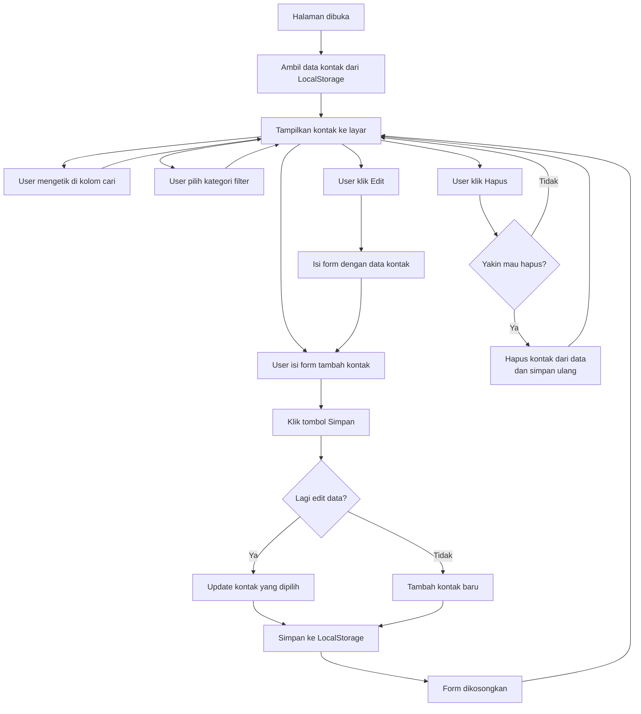

# ✨Address Book
Web simpel untuk menyimpan dan mengelola daftar kontak.
Dibuat menggunakan HTML, Tailwind CSS dan JavaScript

## ⚠️Fitur

- Tambah kontak : Nama Lengkap, No. Telepon, Email, Alamat dan Kategori lalu simpan
- Daftar Kontak : Kategori/Keterangan Data, List/Card data, Mengedit dan Menghapus data.
- Tampilan dari Tailwind CSS

## 🚀Teknologi yg digunakan

- HTML
- Tailwind CSS
- JavaScript

## ⬇️ Flowchart

